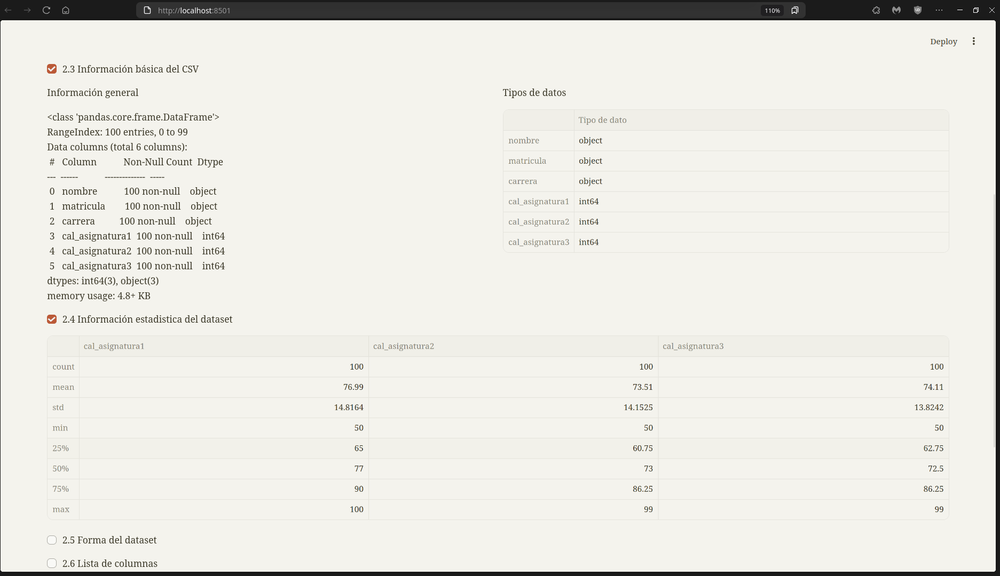

# Evaluación de Pandas y Numpy

El siguiente repositorio contiene el proyecto relacionado a la materia *Extracción de Conomientos en Base de Datos*.

## Equipo de desarrollo

* Janneth Santos Molina
* Juan Carlos Hernández Vázquez
* Patricio de Jesús Vargas Ramírez

## Instalación

Una vez clonado el respostiorio ejecuta la siguiente instrucción:

```py
# Instalación de dependiencias
pip install -r requirements.txt
```

Con todas las dependencias instaladas, ejecuta:
```
streamlit run app.py
```

Ahora puedes visitar: `http://localhost:8501` en caso de que no se iniciara automáticamente tu navegador :)

Puedes utilizar el archivo de ejemplo `datos_estudiantes.csv`, ubicado en la raíz del proyecto, esto para realizar las pruebas necesarias.

## Capturas de pantalla

1. Inicio de la aplicación web

2. Funciones de la aplicación web

3. Ejemplo de una función


## Estructura del proyecto

```
├── app.py
├── datos_estudiantes.csv
├── main.py
├── prueba_funcionamiento
│   ├── prueba_1.png
│   ├── prueba_2.png
│   ├── prueba_3.png
├── README.md
├── requirements.txt
├── static
│   ├── FiraCode-VF.ttf
│   ├── styrene
│   │   ├── *.otf
│   ├── Styrene_B_Family
│   │   ├── *.otf
│       ├── *.otf
├── utils.py
```

*Créditos al diseño inspirado en Anthropic: [jrieke](https://github.com/jrieke), click [aquí](https://github.com/jrieke/advanced-theming-anthropic/tree/main) para ver el repositorio.*
